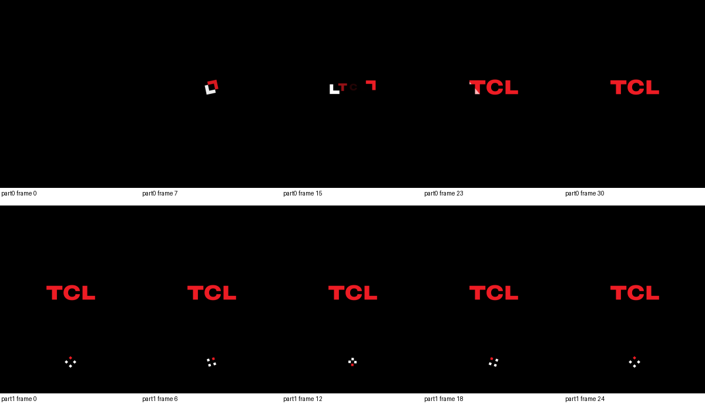

# TCL Flip 2 — Restore Stock Boot Animation

A reversible Magisk module that replaces the US Cellular startup animation on the rooted **TCL 4058L / TCL Flip 2** with the stock, unbranded TCL animation captured from a **TCL 4058G**.



## What It Changes

The module overlays:

```text
/product/media/bootanimation.zip
```

with the unbranded animation at:

```text
system/product/media/bootanimation.zip
```

It does **not** modify the physical `/product` partition, the MediaTek `logo` partition, shutdown animation, charging graphics, launcher, or telephony configuration.

## Tested Hardware And Firmware

| Role | Model | Device | Build | Android |
|---|---|---|---|---|
| Target | TCL 4058L | `Gflip6_USCC` | `PJ3R` | 11 |
| Animation source | TCL 4058G | `Gflip6_NA_OM` | `UPEJ` | 11 |

Both devices use a 240×320 display. The source animation is 240×320 at 30 fps and contains only TCL branding.

## Requirements

- Rooted TCL 4058L / TCL Flip 2
- Magisk 30.7 or compatible
- A complete backup before changing boot-time assets

## Install

### Magisk App

1. Download `tcl-unbranded-bootanimation-magisk-v1.0.0.zip` from the [v1.0.0 release](../../releases/tag/v1.0.0).
2. Open Magisk → **Modules** → **Install from storage**.
3. Select the ZIP and reboot.
4. Watch the first reboot physically; ADB is unavailable during the early animation.

### Command Line

```sh
adb push tcl-unbranded-bootanimation-magisk-v1.0.0.zip /data/local/tmp/
adb shell su -c 'magisk --install-module /data/local/tmp/tcl-unbranded-bootanimation-magisk-v1.0.0.zip'
adb reboot
```

## Verify

After Android finishes booting:

```sh
adb shell su -c 'sha256sum /product/media/bootanimation.zip'
```

Expected active animation digest:

```text
dc95c9372c15785ea7bf4884a638de21b4eb62bc22457f5c7d50a5209767c025
```

Then verify ADB, root, launcher, and normal telephony/SIM state.

## Roll Back

In the Magisk app, disable or remove **TCL Unbranded Boot Animation**, then reboot. The untouched US Cellular firmware animation becomes active again.

Emergency command-line disable:

```sh
adb shell su -c 'touch /data/adb/modules/tcl_unbranded_bootanimation/disable'
adb reboot
```

## Why Use Magisk Instead Of Replacing The File Directly?

On the tested 4058L firmware, `/product` is an ext4 device-mapper partition mounted read-only with dm-verity enforcing. Its boot-animation library searches `/product`, `/oem`, `/system`, and APEX locations; it does not include the traditional writable `/data/local/bootanimation.zip` override.

A direct replacement would therefore require rebuilding or remounting/flashing verified firmware partitions. That can survive without Magisk, but it is substantially more invasive and harder to roll back. Magisk overlays one file during boot while leaving the original partition bytes untouched.

## Integrity

| Artifact | SHA-256 |
|---|---|
| Unbranded `bootanimation.zip` | `dc95c9372c15785ea7bf4884a638de21b4eb62bc22457f5c7d50a5209767c025` |
| Release module ZIP | `7dcbd73ff2e1739c9f35bd37084a4f9db754a50214a785fbdaaa1f88292cb73a` |

The ZIP entries in the Android animation are stored without compression, as required by this firmware's boot-animation implementation.

## Status Note

The source animation was captured read-only from the 4058G, visually inspected frame-by-frame, and structurally verified. The module installed successfully on the target 4058L and staged the exact verified payload. Post-reboot ADB verification was pending because the phone requested USB-debugging authorization again; visually confirm the animation and re-authorize ADB before relying on command-line health checks.

## Support and contributions

This repository is published as-is. I am not offering support through GitHub Issues and I am not accepting pull requests. If you want to modify or extend the project, fork it and maintain your own version.

## License And Asset Notice

Scripts and documentation are MIT-licensed. The TCL boot-animation artwork is an extracted firmware asset and remains the property of its respective rights holder; see [NOTICE](NOTICE).
